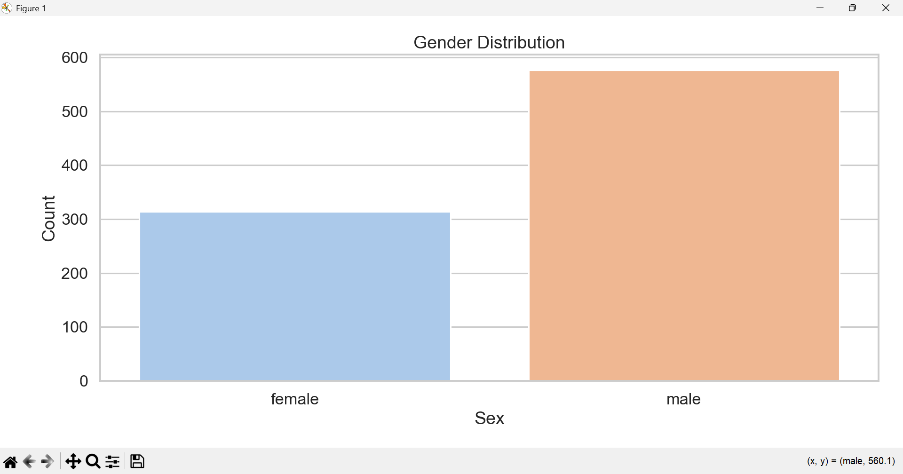
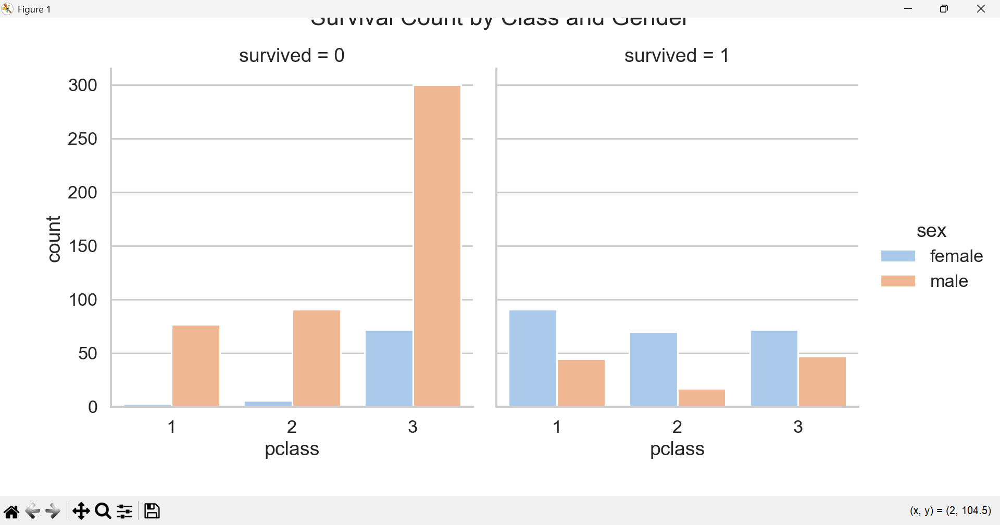
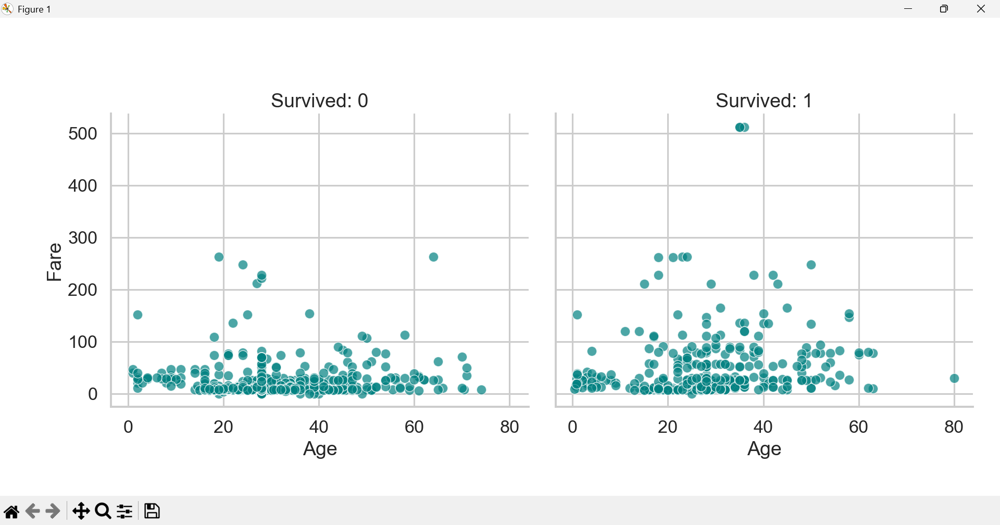

# CelebalTechAssignmentWeek3
# Titanic Data Visualization Assignment🚢📊

A complete exploratory data analysis and visualization project using the Titanic dataset from Seaborn.  
This project focuses on uncovering patterns related to passenger survival based on features like gender, age, class, fare, and family size.

---

## 📁 Structure
CelebalTechAssignmentWeek3/
├── DataVisualization.py # Main Python script with all analysis & plots
├── visuals/                     # Folder with all saved plots 
├── Outputs
├── README.md                    # Project documentation
├── requirements.txt             # Required Python libraries
└── LICENSE                      # License file (MIT)

---

## 📊 Key Visualizations

- **Univariate Analysis**: Age distribution, passenger class count, fare boxplot
- **Bivariate Analysis**: Survival by gender, class, embarkation port
- **Multivariate Analysis**: Survival by class & gender, pairplot of numerical features
- **Creative Plots**:
  - KDE and violin plots
  - FacetGrid scatterplots
  - Family size analysis
  - Pie chart of survivors by gender

---

## 📸 Sample Visuals

### 🔹 Gender Distribution

### 🔹 Survival by Class and Gender

### 🔹 Age vs Fare (by Survival)

---

## 🧠 Key Insights

- **Females** had a much higher survival rate than males.
- **1st class passengers** had better survival odds than 2nd and 3rd.
- **Children and small families** had better survival chances.
- **Higher fares** were correlated with survival — most high-paying passengers survived.

---

